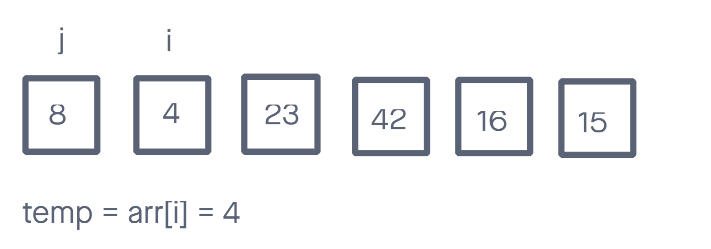
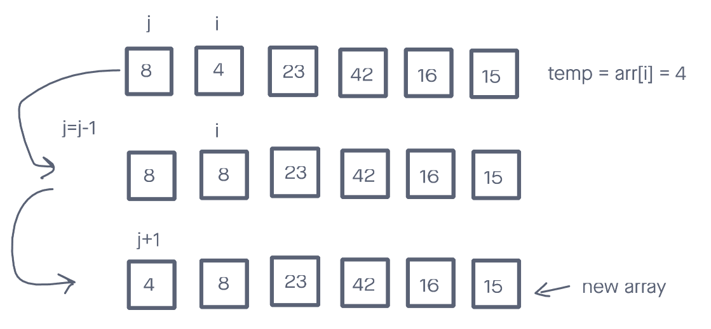
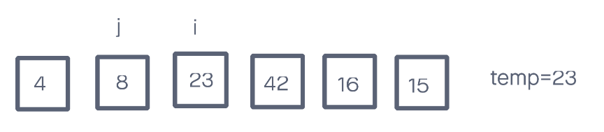
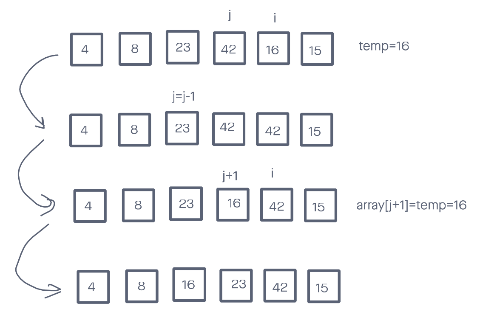
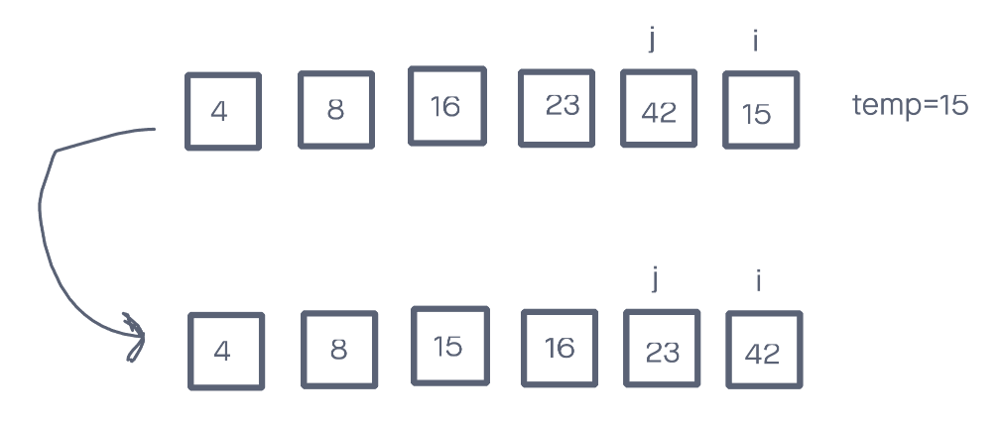

## Insertion Sort
This blog will will show a sorting algorithm about how to traverse an array, then return an new array with array elements in sorting sequence. New array will be incrementally sorted.

### Code
```
  def insertion_sort(arr):
  for i in range(1, len(arr)):
    j = i - 1
    temp = arr[i]

    while j >= 0 and temp < arr[j]:
      arr[j+1] = arr[j]
      j -= 1

    arr[j+1] = temp
```

### Given sample array
```
[8, 4, 23, 42, 16, 15]
```

### Trace
#### Step 1

We will iterate every element in the array starting from index 1. let i equals the current starting index and j equals i-1. Also set "temp" equals the value of array[i] at the beginning of every iteration. For now, temp equals 4.


#### Step 2

if j >= 0 and temp less than array[j]'s value, set array[j+1]'s value equals array[j]'s value, also set j = j-1, then the array should be like the second line in the picture. For now, j = j-1 = 0-1, which is not >= 0, so iteration stopped. Set array[j+1]'s value equals temp, which means array[0] = 4. The new array should be like the line 3 in the picture.

#### Step 3

New round iteration in the for loop start. This time i=2, so j=i-1=1, temp=array[i]=23. 23 is not less than any elements on the left side so there is no movement. When i=3, temp=43, it will repeat the same situation.
#### Step 4

The following round will be i=4, where temp=16. We will repeat the process in step2. The loop will keep iteration until nothing on the left side is larger than temp, then it will return line4 in the pic.

#### Step 5

Finally we get to the last round, where i=5. Just repeat what we did in step 4. The final results will be like line 2 in the picture. Iteration complete, new array sorted in assending order.

### BigO
* Time: O(n^2). Every elements will iterate n-1 times, n(n-1)=n^2-n, so n squared time is expected.
* Space: O(1). No new elements will be created so the space is constant.
